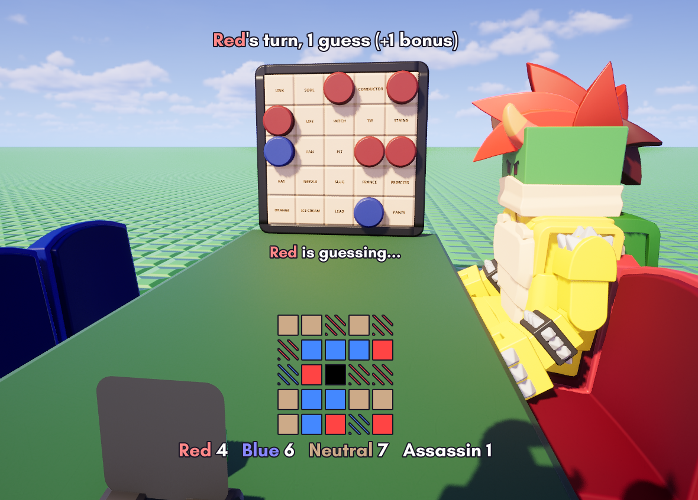

# Codenames

**Share Code**: `t0s-g3u-k5s`

A complete [Codenames](https://czechgames.com/en/codenames/) game circuit written in
[Wirescript](https://wirescript.brickadia.dev/) for [Brickadia](https://brickadia.com/).
One controller microchip drives a physical 5x5 word board and runs the entire game for
**2–8 players**.

## What it does

- **Seats & roles** - Two teams (red / blue), each with a spymaster and up to three
  operatives. Players sit down and tap **W** to ready up; readying toggles a colored cover
  in front of the seat.
- **Clues** - On its turn a team's spymaster picks a number with **A/D** (0 and 8 mean
  unlimited) and confirms with a double-**W**. The word itself is spoken aloud.
- **Guessing** - Operatives press word cards to guess. A correct guess keeps the turn going
  (up to the clue number **+1 bonus**); a neutral or the other team's card ends it; the
  **assassin** loses instantly. Double-**W** passes early.
- **Spymaster view** - Each spymaster sees the full key as a colored 5x5 grid on their
  screen, plus a live tally of how many red / blue / neutral / assassin cards remain.
- **Bot & solo-spy modes** - If one team has no players it's run by a bot that reveals one
  of its own agents each turn (a steady race). With two spymasters and a single shared
  operative, that operative guesses for whichever team just clued.
- **Robust to real play** - Covers can be toggled globally with **Space** to re-read the
  words; leaving a seat un-readies you and clears your HUD; a lone remaining player can reset
  a stuck game; and the full key is shown to everyone at game end.

## Layout

| File | Responsibility |
|------|----------------|
| `main.ws` | Controller: seat occupancy, mode detection, phase machine, key generation, clue / guess / bot resolution, win & assassin, the declarative board push, the per-seat HUD, and the input queue |
| `key.ws` | Role + cover-color model and pure helpers (`buildRoles`, `classifyGuess`, `coverColorOf`, `glyphHexOf`) |
| `words.ws` | The 400-word Codenames list |
| `hud.ws` | Pure HUD string builders (banner, clue / guess prompts, 5x5 grid cell, outcome text) |
| `test_*.ws` | Unit tests - real `.ws` programs that assert against known outputs and print `ok` to chat |

## Board contract

- **Board → controller** - 25 `press` character outputs (one per cell, giving whoever pressed
  it) and 8 seat occupants (`redSpy`, `red0`–`red2`, `blueSpy`, `blue0`–`blue2`).
- **Controller → board** - per cell: a `text` word label, a `covered` boolean, and a cover
  `color`. The whole board render is declarative - a reveal is just one bit set in a mask.
- Banner, prompts, and the spymaster key grid are drawn per-player via `DisplayText`, not
  board ports.

## Controls

- **Spymaster:** **A/D** change the clue number, **W** twice to confirm.
- **Operative:** press a word card to guess, **W** twice to pass.
- **Anyone:** **Space** toggles the card covers; **W** readies up in the lobby and
  acknowledges the game-over screen.

## Building

Compile the sources with the
[Wirescript compiler](https://github.com/Meshiest/wirescript) and load the resulting
`main.brz` in Brickadia, then wire the controller's ports to your board's word signs,
cover bricks, cell buttons, and seats.

## Attribution

Based on **Codenames**, a game designed by _Vlaada Chvátil_, illustrated by
_Tomáš Kučerovský_, and published by Czech Games Edition.

This is a non-commercial fan implementation and is not affiliated with or endorsed by the
original creators. Codenames is a copyrighted commercial game; this circuit reproduces only
its rules for play on a Brickadia board. Learn about or buy the physical game from its
publisher.
