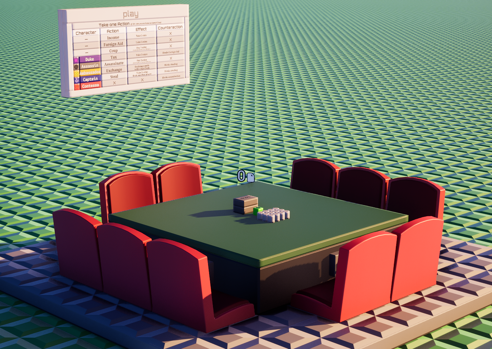

# Coup

**Share Code**: `g43-m00-q61` (Download the prefab in-game and play!)

A complete [Coup](https://boardgamegeek.com/boardgame/131357/coup) game circuit
written in [Wirescript](https://wirescript.brickadia.dev/) for
[Brickadia](https://brickadia.com/). The compiled microchip drives a physical
board and runs the entire game for **3–10 players**.

## What it does

- **Seats & input** — Each seated player controls with **A / D / W / S / Space**.
  A/D move a cursor, **W** is the affirmative (confirm / allow / accept), **S**
  blocks, and **Space** challenges. Every confirmation is a deliberate double
  press, so a stray keystroke never costs a card.
- **Full game loop** — Two-influence deal from a role deck that scales with the
  table (3/4/5 copies of each role), coin economy, and the seven actions:
  Income, Foreign Aid, Coup, Tax, Assassinate, Exchange, and Steal.
- **Bluffing, fully modelled** — Every claimed action is challengeable. A
  challenge reveals whether the claim was genuine: an honest claimant reveals
  the card, shuffles it back, and draws a replacement while the challenger loses
  influence; a caught bluffer loses influence and the action is reverted.
- **Blocks and counter-blocks** — Foreign Aid (Duke), Assassinate (Contessa),
  and Steal (Captain **or** Ambassador) can be blocked. A block is itself a
  claim: the actor may challenge or accept it, and any player may challenge it in
  turn. Both the target's decision and the actor's response happen on-board.
- **The full ruleset** — The forced coup at 10+ coins, the two-influence
  penalty for a caught bluffed block, the Ambassador's exchange with the court
  deck, per-role deck counts, elimination when both influences are lost, and the
  last-player-standing win — all resolved on the board.
- **Robust to real play** — Absent players are skipped, disconnects mid-decision
  are recovered by a watchdog rather than freezing the table, and a lone player
  can reset a finished or stuck game.

## Layout

| File | Responsibility |
|------|----------------|
| `main.ws` | Board contract, phase machine, input dispatch, response/challenge/block resolution, board outputs, HUD |
| `cards.ws` | Role constants and card text/icon rendering |
| `hand.ws` | Influence and public card-slot bit math |
| `actions.ws` | Action table: cost, gain, target, claimed role, blocking role |
| `deck.ws` | Court deck: build, shuffle, draw, return, per-role counts |
| `display.ws` | HUD wrappers and name sanitisation |
| `test_*.ws` | Unit tests (real `.ws` programs that assert against known outputs) |

## Board contract

- **Inputs** — ten `character` seat ports, `player0`–`player9`, wired on the
  right. A smaller board may omit the last four; unwired seats simply never join
  a game.
- **Outputs** — per-seat packed integers (card0 / card1 / coins), seat bitmasks
  (`turn`, `aim`, `ready`, `selecting`, `discarding`, `playing`, `block`), the
  deck total and per-role counts, and a `shortDeck` flag for the deck prop. Each
  seat's hidden cards and private prompts are delivered to that player only.

## Building

Compile the sources with the
[Wirescript compiler](https://github.com/Meshiest/wirescript) and load the
resulting `main.brz` in Brickadia. The board must supply the `player0`–`player9`
seat inputs on the right and wire up the left-side outputs the circuit drives.

## Attribution

Based on **Coup**, a game designed by _Rikki Tahta_ and illustrated by
_Jordi Roca_, published by La Mame Games and Indie Boards & Cards.

This is a non-commercial fan implementation and is not affiliated with or
endorsed by the original creators. Coup is a copyrighted commercial game; this
circuit reproduces only its rules for play on a Brickadia board. Learn about or
buy the physical game from its publisher.
