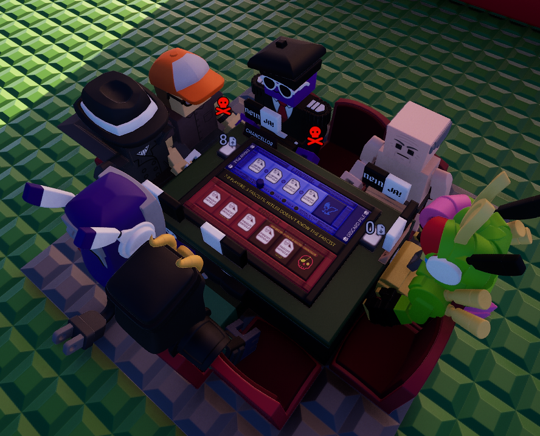
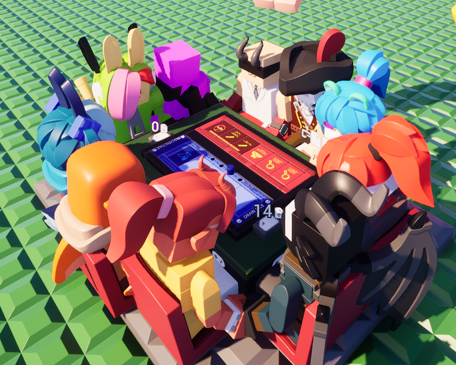
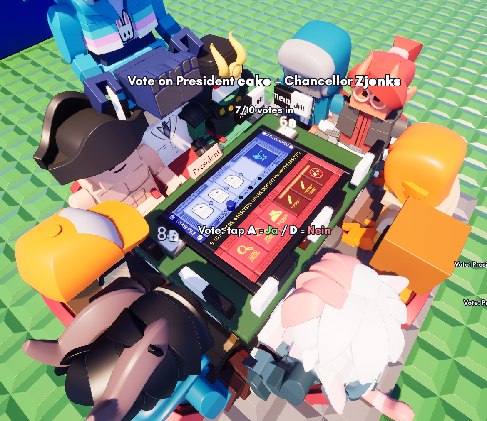

# Secret Hitler

**Share Code**: `p7m-v00-c2d` (Download the prefab in-game and play!)

  

A complete [Secret Hitler](https://www.secrethitler.com/) game circuit written in
[Wirescript](https://wirescript.brickadia.dev/) for [Brickadia](https://brickadia.com/).
The compiled microchip drives a physical board and runs the entire game for **5–10
players**.

## What it does

- **Seats & input** - Each seated player controls with **A / W / D**
- **Full game loop** - Secret role deal, night reveal (fascists learn each other + Hitler),
  chancellor nomination, Ja/Nein voting, the legislative session (president discards one
  policy, chancellor enacts one), presidential powers (investigate, peek, special election,
  execution), the veto power, the election tracker with the chaos rule, and term limits.
- **Win conditions** - Liberal and fascist policy tracks, Hitler-elected-chancellor and
  Hitler-executed outcomes, all resolved on-board.

## Layout

| File | Responsibility |
|------|----------------|
| `main.ws` | Board contract, phase machine, input dispatch, board outputs |
| `gov.ws` | Eligibility, presidency rotation, election tracker |
| `deck.ws` | Policy deck (draw / discard / reshuffle) |
| `powers.ws` | Presidential powers + role/policy constants |
| `outcome.ws` | Win-condition logic |
| `display.ws` | HUD and board text |
| `test_*.ws` | Unit tests (real `.ws` programs that assert against known outputs) |

## Building

Compile the sources with the [Wirescript compiler](https://github.com/Meshiest/wirescript)
and load the resulting `main.brz` in Brickadia. The board must supply the `player0`–`player9`
seat inputs on the right and wire up the left-side outputs the circuit drives.

## Attribution

Based on **Secret Hitler**, a social deduction game by*Mike Boxleiter, Tommy Maranges,
and Max Temkin, illustrated by Mackenzie Schubert.

Secret Hitler is released under
[Creative Commons BY-NC-SA 4.0](https://creativecommons.org/licenses/by-nc-sa/4.0/). This
is a non-commercial fan implementation and is not affiliated with or endorsed by the
original creators. Learn about or buy the physical game at https://www.secrethitler.com/.
