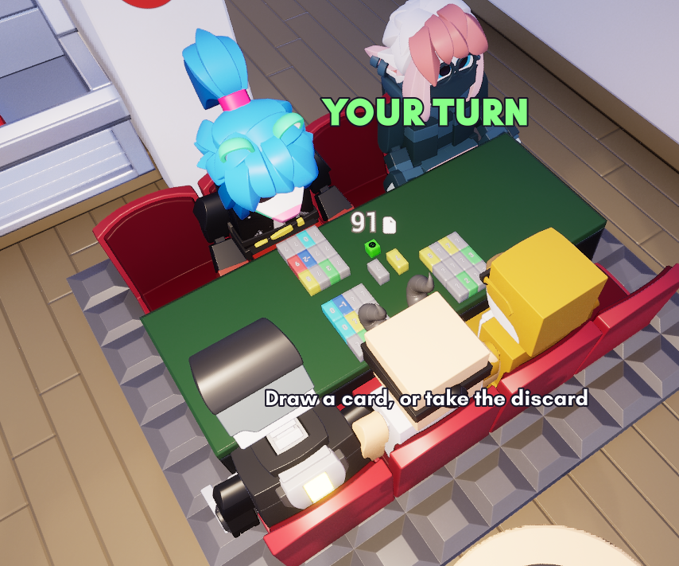
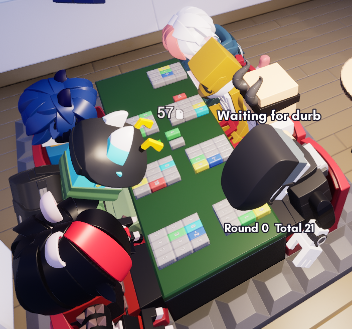

# Skyjo

**Share Code**: `v82-e7u-72z`

 

A complete [Skyjo](https://magilano.com/produkt/skyjo/) game circuit written in
[Wirescript](https://wirescript.brickadia.dev/) for [Brickadia](https://brickadia.com/).
One controller microchip plus a per-seat player terminal (stamped up to 8×) drive a
physical board and run the entire game for **2–8 players**.

## What it does

- **Seats & input** — Each seat is a terminal with a 3x4 grid of card buttons plus a
  drawn-card button; players click to draw, take, swap, and flip. **W** readies up in the
  lobby and acknowledges the round-over screen. Shared central draw and discard piles are
  gated to the current turn-holder.
- **Full game loop** — The 150-card deck (values −2 thru 12), the deal of 12 face-down cards,
  the flip-two setup, and turns of *draw-from-deck or take-the-discard* then *swap a card
  or decline-and-flip*. Three matching face-up cards in a column clear it.
- **Round & match end** — When a player turns their whole hand face-up, **everyone else
  gets one final turn** before the round scores. The round-ender's score is doubled if they
  aren't lowest (the standard penalty). Totals accumulate across rounds; the match ends when
  a player reaches **100**, and the lowest total wins.
- **Hidden information** — A face-down card's real value lives only in the controller and is
  masked to zero on the wire, so nothing leaks to the player's own terminal until it flips.
- **Robust to real play** — Absent seats are skipped; a player who draws and then leaves is
  auto-flipped rather than dodging the turn; an accidental discard can be undone by clicking
  the pile; and a lone remaining player can reset a stuck or finished game.

## Layout

| File | Responsibility |
|------|----------------|
| `main.ws` | Controller: seat occupancy, phase machine, central input queue, turn logic, column-clear / round-end, scoring, and the per-seat board push |
| `player.ws` | Per-seat terminal (stamped once per seat): 13 card buttons, colour/text lookup-table decode of the pushed cells, and press reporting |
| `cards.ws` | Packed-cell encoding (state + value in one int) and the colour / text bands |
| `deck.ws` | 150-card deck: build, draw (with reshuffle), deal-pop, discard |
| `grid.ws` | Hand grid: column-clear, all-face-up test, hand-sum |
| `scoring.ws` | Round scoring: round-ender doubling, cumulative totals, lowest-seat winner |
| `test_*.ws` | Unit tests (real `.ws` programs that assert against known outputs) |

## Board contract

- **Controller (`main.ws`)** — takes eight `character` seat ports (`seat0`–`seat7`) plus
  each terminal's `press`/`slot` report and the central `drawBtn`/`discardBtn` characters
  on the right; drives each seat's packed 13-cell board array + an `update` pulse on the
  left, and the central discard colour/text + deck count on the bottom.
- **Terminal (`player.ws`)** — one instance per seat: takes the 13 card-button `character`
  outputs, the seat occupant, and the controller's `cards` array + `update`; drives 13
  colour + 13 text outputs to the card signs and reports the pressed slot back to the
  controller. Unwired seats simply never join a game.

## Building

Compile the sources with the
[Wirescript compiler](https://github.com/Meshiest/wirescript) and load the resulting
`main.brz` (controller) and `player.brz` (terminal, placed once per seat) in Brickadia.
Wire each terminal's ports to its seat's buttons and signs, and the terminals' `press` /
`slot` / `seat` back to the controller.

## Attribution

Based on **Skyjo**, a card game designed by _Alexander Bernhardt_ and published by
Magilano GmbH.

This is a non-commercial fan implementation and is not affiliated with or endorsed by the
original creators. Skyjo is a copyrighted commercial game and "SKYJO" is a trademark of
Magilano GmbH; this circuit reproduces only its rules for play on a Brickadia board. Learn
about or buy the physical game from its publisher.
